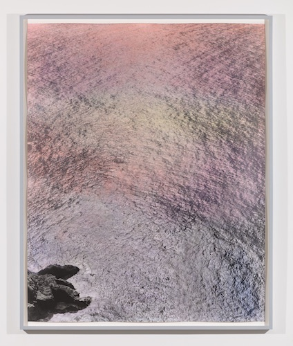

# Experimental Shaders Project

> Or is it "Experimenting with Shaders"?

### 150 Word Overview

For my project I'm going to be building procedurally generated water scenes using different programs which will be done completely with a Frag shader, with Vert and Frag shaders combined, and with shaders as the end part of a pipeline being applied to an object. This will probably mean building procedurally generated water both with a single screen shader in WebGL, as part of a pipeline in openFrameworks, and with a high level shader as part of a pipeline in Unity. In the end, I want to create moving water that looks like hand-tinted gelatin silver prints (see photograph below for reference).

### 5 Key Features

* Procedurally generated, moving water with waves and ripples
* Water done entirely with a Frag shader
* Water movement done with a Vert shader, with coloring and lighting done with Frag shader
* Water movement done within program (e.g. Unity or openFrameworks) with coloring and lighting done with Frag shader
* Aesthetically reproduces the look of hand-tinted gelatin silver photographic prints

### 3 Stretch Goals

* Pipeline for passing tinting variables to program to control hand-tinted quality of canvas
* 
* 

### 5 Learning Goals

* Learn how to create procedurally generated terrain using shaders
* Study how Vert shaders work and how to manipulate the points of a canvas or object
* Find out how to light material passed from a Vert shader using a Frag shader
* 
* 
